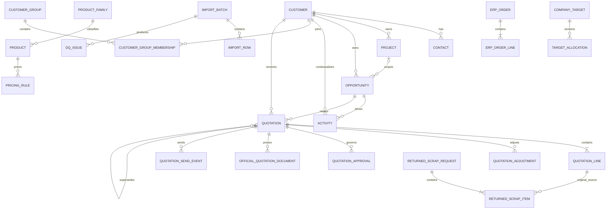

# Step 5 Logical ERD

```mermaid
erDiagram
  CUSTOMER ||--o{ CONTACT : has
  CUSTOMER ||--o{ PROJECT : owns
  CUSTOMER ||--o{ OPPORTUNITY : owns
  PROJECT o|--o{ OPPORTUNITY : scopes
  OPPORTUNITY ||--o{ ACTIVITY : drives
  CUSTOMER ||--o{ ACTIVITY : contextualizes
  CUSTOMER ||--o{ CUSTOMER_GROUP_MEMBERSHIP : joins
  CUSTOMER_GROUP ||--o{ CUSTOMER_GROUP_MEMBERSHIP : contains
  PRODUCT_FAMILY ||--o{ PRODUCT : classifies
  PRODUCT ||--o{ PRICING_RULE : prices
  CUSTOMER ||--o{ QUOTATION : receives
  OPPORTUNITY ||--o{ QUOTATION : relates
  QUOTATION ||--|{ QUOTATION_LINE : contains
  QUOTATION ||--o{ QUOTATION_ADJUSTMENT : adjusts
  QUOTATION ||--o{ QUOTATION_APPROVAL : governs
  QUOTATION ||--o{ OFFICIAL_QUOTATION_DOCUMENT : proves
  QUOTATION ||--o{ QUOTATION_SEND_EVENT : sends
  QUOTATION o|--o{ QUOTATION : supersedes
  IMPORT_BATCH ||--o{ IMPORT_ROW : contains
  IMPORT_BATCH ||--o{ DQ_ISSUE : produces
  ERP_ORDER ||--|{ ERP_ORDER_LINE : contains
  QUOTATION_LINE ||--o{ RETURNED_SCRAP_ITEM : original_source
  RETURNED_SCRAP_REQUEST ||--|{ RETURNED_SCRAP_ITEM : contains
  COMPANY_TARGET ||--o{ TARGET_ALLOCATION : versions
```

All physical tables, FK actions, indexes, and migrations are Step 6-owned.
